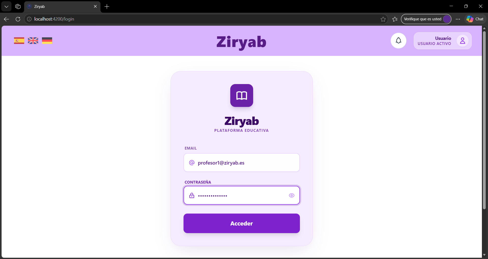
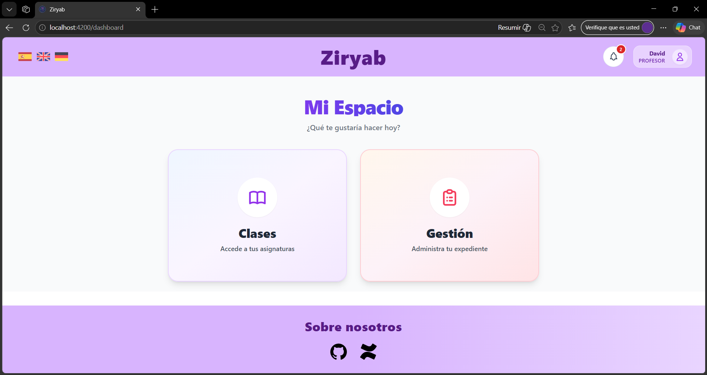
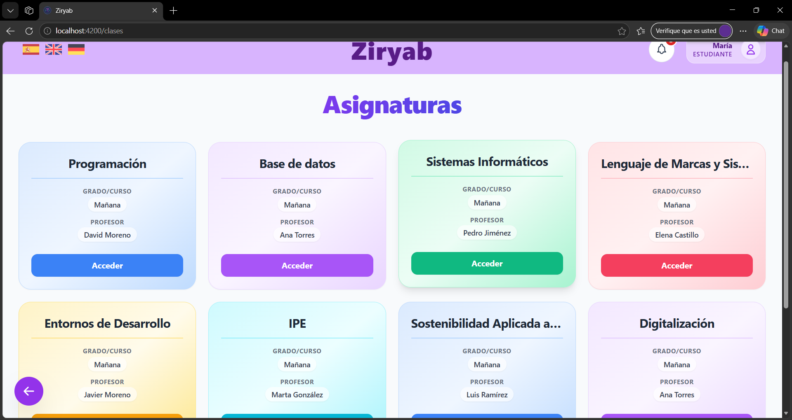
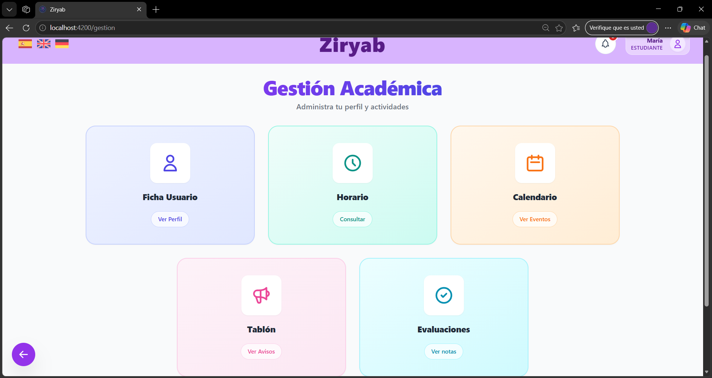
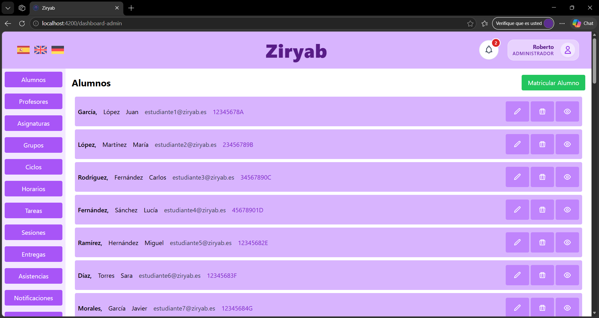
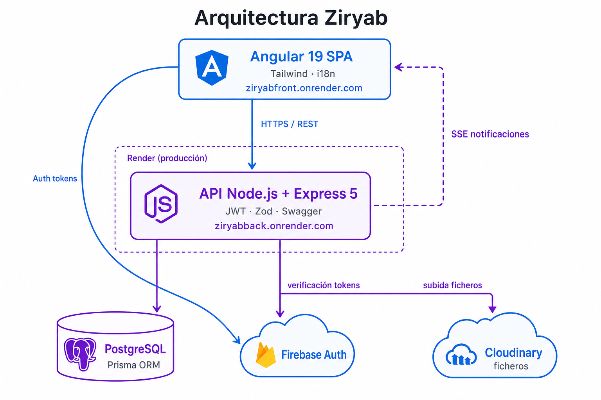

# Ziryab — Plataforma de gestión educativa

**Proyecto Intermodular · 2º DAM (turno de mañana)**  
**Centro:** CPIFP Alan Turing (Málaga) · **Curso:** 2025/2026  
**Exposición:** 5 de junio de 2026 · **Orden:** 2 · **Ventana:** 9:15 – 9:30 (máx. 15 min)

> Repositorio-guía del proyecto. Aquí se centraliza la documentación de exposición exigida por el centro: descripción, equipo, enlaces a código y despliegue, PDFs, Jira y Compodoc.  
> Referencia de requisitos: [guía de exposiciones 2º DAM](https://github.com/CPIFPAlanTuring/exposiciones_proyecto_intermodular_25_26_2DAM_M) *(repositorio `exposiciones_proyecto_intermodular_25_26_2DAM_M` del profesorado)*.

---

## 📑 Índice

- [👥 Personas y equipo](#-personas-y-equipo)
- [📖 Descripción del proyecto](#-descripción-del-proyecto)
- [🏗️ Arquitectura y stack](#️-arquitectura-y-stack)
- [📦 Repositorios de código](#-repositorios-de-código)
- [🚀 Despliegue en producción](#-despliegue-en-producción)
- [📚 Aportación por módulos](#-aportación-por-módulos)
  - [Acceso a Datos](#acceso-a-datos)
  - [Programación Multimedia y Dispositivos Móviles](#programación-multimedia-y-dispositivos-móviles)
  - [Programación de Servicios y Procesos](#programación-de-servicios-y-procesos)
  - [Desarrollo de Interfaces](#desarrollo-de-interfaces)
  - [Servidores y APIs](#servidores-y-apis)
  - [Iniciativa para la Empleabilidad II](#iniciativa-para-la-empleabilidad-ii)
  - [Sistemas de Gestión Empresarial](#sistemas-de-gestión-empresarial)
- [📄 Documentación unificada](#-documentación-unificada)
- [📊 Gestión del proyecto (Jira)](#-gestión-del-proyecto-jira)
- [🧩 Documentación de código (Compodoc)](#-documentación-de-código-compodoc)
- [✅ Checklist antes de la exposición](#-checklist-antes-de-la-exposición)

---

## 👥 Personas y equipo

> *"Digitalizar la gestión del centro para que profesores y alumnos dediquen el tiempo a enseñar y aprender, no al papeleo."*

| Miembro                            | Rol en el proyecto | Correo educaAnd             |
| ---------------------------------- | ------------------ | --------------------------- |
| **Francisco de Asís Cobo Sánchez** | Full Stack         | `fcobsan076@g.educaand.es`  |
| **Antonio Salces Alcaraz**         | Full Stack         | `asalalc1312@g.educaand.es` |
| **Ángela Mora Mata**               | Full Stack         | `amormat1010@g.educaand.es` |

### Stack del proyecto

| Capa               | Tecnología                                       |
| ------------------ | ------------------------------------------------ |
| **Frontend**       | Angular 19 (standalone components)               |
| **Estilos**        | Tailwind CSS + SCSS puntual                      |
| **Backend**        | Node.js + Express 5 + TypeScript (ESM)           |
| **ORM / BD**       | Prisma + PostgreSQL                              |
| **Autenticación**  | Firebase Auth + JWT (cookies httpOnly / Bearer)  |
| **Almacenamiento** | Cloudinary (ficheros)                            |
| **API docs**       | Swagger (`swagger-jsdoc` + `swagger-ui-express`) |
| **Gestión**        | Jira (proyecto `EQ` / trazabilidad `CURSO` en código) |
| **Doc. código**    | Compodoc                                         |
| **Despliegue**     | Render (frontend + API)                          |

---

<table width="100%">
<tr>
<td valign="top"><h3>🧑‍💻 Francisco de Asís Cobo Sánchez</h3></td>
<td align="right" valign="middle" rowspan="2" width="200">
<a href="./assets/team/francisco.jpg"></a>
</td>
</tr>
<tr>
<td valign="top">
<table>
<tr><td>🐙 <strong>GitHub</strong></td><td><a href="https://github.com/yo164">@yo164</a></td></tr>
<tr><td>💼 <strong>LinkedIn</strong></td><td><a href="https://www.linkedin.com/in/francisco-cobo-sánchez-3036b1349/">Perfil</a></td></tr>
</table>
</td>
</tr>
</table>

---

<table width="100%">
<tr>
<td valign="top"><h3>🧑‍💻 Antonio Salces Alcaraz</h3></td>
<td align="right" valign="middle" rowspan="2" width="200">
<a href="./assets/team/Salces_Alcaraz_Antonio.png"></a>
</td>
</tr>
<tr>
<td valign="top">
<table>
<tr><td>🐙 <strong>GitHub</strong></td><td><a href="https://github.com/AntonioSalces">@AntonioSalces</a></td></tr>
<tr><td>💼 <strong>LinkedIn</strong></td><td><a href="https://www.linkedin.com/in/antoniosalces/">Perfil</a></td></tr>
</table>
</td>
</tr>
</table>

---

<table width="100%">
<tr>
<td valign="top"><h3>🧑‍💻 Ángela Mora Mata</h3></td>
<td align="right" valign="middle" rowspan="2" width="200">
<a href="./assets/team/angela.png"></a>
</td>
</tr>
<tr>
<td valign="top">
<table>
<tr><td>🐙 <strong>GitHub</strong></td><td><a href="https://github.com/angela1006">@angela1006</a></td></tr>
<tr><td>💼 <strong>LinkedIn</strong></td><td><a href="https://www.linkedin.com/in/ángela-mora-mata-b8458a329/">Perfil</a></td></tr>
</table>
</td>
</tr>
</table>

---

## 📖 Descripción del proyecto

**Ziryab** es una plataforma web de gestión educativa para **cualquier centro donde se impartan clases**: centros públicos y privados, academias, conservatorios, centros de formación profesional, etc. Sustituye procesos en papel y hojas de cálculo dispersas por un único entorno digital con **tres roles** (`STUDENT`, `TEACHER`, `ADMIN`).

### Problema que resuelve

Los centros gestionan matrículas, horarios, asistencia, tareas, calificaciones e incidencias con herramientas heterogéneas. Eso genera duplicidad de datos, errores de coordinación entre profesorado y administración, y poca visibilidad para el alumnado.

### Solución

Aplicación **SPA** (Angular) consumiendo una **API REST** (Node/Express) sobre **PostgreSQL**, con autenticación híbrida **Firebase + JWT** del backend propio.

### Funcionalidades principales

| Área              | Descripción                                                                                                    |
| ----------------- | -------------------------------------------------------------------------------------------------------------- |
| **Alumno**        | Dashboard, clases, horario, temario, tareas y entregas, notas, ficha de usuario, notificaciones en tiempo real |
| **Profesor**      | Clases asignadas, pasar lista, tareas por asignatura, gestión de notas, horario, menú de clase                 |
| **Administrador** | CRUD de alumnos, profesores, asignaturas, ciclos, grupos, horarios semanales, incidencias, anuncios, informes  |
| **Transversal**   | i18n (es / en / de), calendario integrado, avisos SSE, subida de ficheros (Cloudinary), documentación Swagger  |

### Capturas

Vista previa en miniatura; **clic en la imagen** para abrirla a tamaño completo.

| Vista               | Captura |
| ------------------- | ------- |
| Login y roles       | <a href="./assets/screenshots/login.png"></a> |
| Panel principal     | <a href="./assets/screenshots/principal.png"></a> |
| Clases              | <a href="./assets/screenshots/clases.png"></a> |
| Gestión             | <a href="./assets/screenshots/gestion.png"></a> |
| Panel administrador | <a href="./assets/screenshots/admin-dashboard.png"></a> |

### Diagrama de arquitectura

<a href="./assets/diagramas/arquitectura.png"></a>

---

## 🏗️ Arquitectura y stack

| Componente        | Tecnología / URL                                                                             |
| ----------------- | -------------------------------------------------------------------------------------------- |
| **Frontend**      | Angular 19, Tailwind — [ziryabfront.onrender.com](https://ziryabfront.onrender.com/)         |
| **API**           | Node.js, Express 5, Swagger — [ziryabback.onrender.com](https://ziryabback.onrender.com/api) |
| **Base de datos** | PostgreSQL + Prisma ORM                                                                      |
| **Autenticación** | Firebase Auth + JWT (backend)                                                                |
| **Ficheros**      | Cloudinary                                                                                   |
| **Tiempo real**   | SSE (notificaciones)                                                                         |

---

## 📦 Repositorios de código

| Repositorio  | Descripción            | URL                                                     |
| ------------ | ---------------------- | ------------------------------------------------------- |
| **Frontend** | Cliente Angular 19     | [Pincha aquí](https://github.com/Paco16889/ZiryabFront) |
| **Backend**  | API REST Node + Prisma | [Pincha aquí](https://github.com/yo164/ZiryabBack)      |
| **Guía TFG** | Este repositorio       | [Pincha aquí](https://github.com/Paco16889/TFG-Ziryab)  |

---

## 🚀 Despliegue en producción

| Servicio                      | URL                                                                                  | Notas                                      |
| ----------------------------- | ------------------------------------------------------------------------------------ | ------------------------------------------ |
| **API (producción)**          | [https://ziryabback.onrender.com/api](https://ziryabback.onrender.com/api)           | Desplegada en Render                       |
| **Swagger / API docs**        | [https://ziryabback.onrender.com/api-docs](https://ziryabback.onrender.com/api-docs) | Documentación interactiva de endpoints     |
| **Health check**              | [https://ziryabback.onrender.com/health](https://ziryabback.onrender.com/health)     | Monitorización básica                      |
| **Aplicación web (frontend)** | [https://ziryabfront.onrender.com/](https://ziryabfront.onrender.com/)               | SPA Angular desplegada en Render           |
| **Compodoc (servidor)**       | [https://antoniosalces.github.io/ziryab-compodoc/index.html](https://antoniosalces.github.io/ziryab-compodoc/index.html) | Desplegado en GitHub Pages                 |

### Credenciales de prueba para el tribunal

> Acceso en [https://ziryabfront.onrender.com/](https://ziryabfront.onrender.com/) con autenticación **Firebase** (proyecto `ziryab-7006e`).

| Rol               | Email                 | Contraseña       |
| ----------------- | --------------------- | ---------------- |
| **Alumno**        | `alumno2@ziryab.es`   | `Alumno123456`   |
| **Profesor**      | `profesor1@ziryab.es` | `Profesor123456` |
| **Administrador** | `admin1@ziryab.es`    | `Admin123456`    |

---

## 📚 Aportación por módulos

Por cada módulo: **aportación al proyecto**, **evidencias en Jira** (tablero `EQ`) y, cuando aplica, **rutas en repositorio** (front `angular/`, back `node/`).

---

### Acceso a Datos

**Profesor/a:** Juan Antonio García Gómez

**Aportación al proyecto:** En Ziryab, la parte vinculada a este módulo en el **cliente** se centró en **Angular**: organización de la capa de acceso a datos mediante **servicios** (`providedIn: 'root'`), **inyección de dependencias** con `inject()`, **pipes** para transformar información en plantillas y **signals** para el estado reactivo de la UI. La **persistencia relacional** (Prisma, migraciones, seeds) se documenta en [Servidores y APIs](#servidores-y-apis).

**Evidencias (Jira):**
- [EQ-30](https://g-team-ddm5j4dr.atlassian.net/browse/EQ-30) — Acceso a datos del backend (capa de servicios en el front)
- [EQ-28](https://g-team-ddm5j4dr.atlassian.net/browse/EQ-28) — Pipes personalizados
- [EQ-238](https://g-team-ddm5j4dr.atlassian.net/browse/EQ-238) — Tipado de signals en `ClasesComponent` y `ClasesProfesorComponent`
- [EQ-315](https://g-team-ddm5j4dr.atlassian.net/browse/EQ-315) — `SelectedStudentService` con signals
- [EQ-298](https://g-team-ddm5j4dr.atlassian.net/browse/EQ-298) — Migración de assignments y servicios Angular
- [EQ-333](https://g-team-ddm5j4dr.atlassian.net/browse/EQ-333) — `StudentPasswordService` (`inject()`, `core/services/`)

**Evidencias en repositorio:** `node/prisma/schema.prisma`, `node/prisma/migrations/`, `node/prisma/seed.ts`

---

### Programación Multimedia y Dispositivos Móviles

**Profesor/a:** David Hormigo Ramírez

> **Alcance de este módulo en Ziryab:** **experiencia en dispositivo** — SPA **responsive** (Angular + Tailwind) y **pantallas de la app Android** (UI nativa). No incluye la API **Node.js** ([Servidores y APIs](#servidores-y-apis)), los **servicios HTTP** de Angular ([Acceso a Datos](#acceso-a-datos)) ni la **lógica en Kotlin** (repositorios, coroutines: [PSP](#programación-de-servicios-y-procesos)).

**Aportación al proyecto:** Diseño **mobile first** en la web: layouts con utilidades Tailwind (`sm:`, `md:`, `lg:`), navegación y formularios usables en móvil, tablet y escritorio. Complemento con **cliente Android nativo** (mismas áreas funcionales que la web en el aula, adaptadas a pantalla táctil). La app se puede probar en dispositivo o emulador; no está publicada como APK en este repo.

| Canal              | Qué cubre PMDM en Ziryab                                                                 |
| ------------------ | ---------------------------------------------------------------------------------------- |
| **Web (Angular)**  | Adaptación responsive de login, dashboards, clases, horario, tareas, ficha de usuario…   |
| **Android (UI)**   | Pantallas táctiles de profesor y alumno (lista, horario, faltas, tareas) — sin capa PSP   |

**Evidencias (Jira):**
- [EQ-377](https://g-team-ddm5j4dr.atlassian.net/browse/EQ-377) — Revisar UI/UX: coherencia visual, estados y **responsive en móviles** *(criterio de aceptación explícito)*
- [EQ-352](https://g-team-ddm5j4dr.atlassian.net/browse/EQ-352) — Arreglos de Front (UI adaptable en pantallas del proyecto)
- [EQ-265](https://g-team-ddm5j4dr.atlassian.net/browse/EQ-265) — Componentes de **horario** alumno y profesor (vista usable en distintos viewports)
- [EQ-11](https://g-team-ddm5j4dr.atlassian.net/browse/EQ-11) · [EQ-36](https://g-team-ddm5j4dr.atlassian.net/browse/EQ-36) — CRUD admin con **interfaz responsive** en el DoD

**Evidencias en repositorio:** `angular/src/app/pages/` (plantillas con Tailwind), `angular/tailwind.config.js`, componentes de horario en `pages/alumno/` y `pages/profesor/`

**Limitaciones / futuro:** la app Android no tiene tickets propios de “pantalla móvil” en Jira (véase [EQ-141](https://g-team-ddm5j4dr.atlassian.net/browse/EQ-141) en PSP); **PWA** instalable como mejora futura de la web.

---

### Programación de Servicios y Procesos

**Profesor/a:** David Hormigo Ramírez

> **Alcance de este módulo en Ziryab:** solo la **aplicación Android nativa en Kotlin**. Los servicios y procesos de **Angular** y **Node.js** se documentan en [Acceso a Datos](#acceso-a-datos), [Servidores y APIs](#servidores-y-apis) y [Desarrollo de Interfaces](#desarrollo-de-interfaces); la interfaz móvil responsive en [PMDM](#programación-multimedia-y-dispositivos-móviles).

**Aportación al proyecto:** Cliente móvil complementario a la web, organizado en **capas de servicio** (repositorios, casos de uso o equivalentes) que encapsulan el acceso a la API REST de Ziryab. Los **procesos asíncronos** se resuelven con **Kotlin coroutines** (llamadas HTTP, autenticación Firebase → JWT del backend, carga de pantallas y flujos de aula). Funcionalidades implementadas en el dispositivo:

| Área (rol)   | Procesos en la app Android                          |
| ------------ | --------------------------------------------------- |
| **Común**    | Login con Firebase, sesión con token del backend    |
| **Profesor** | Pasar lista (4 estados), consulta de clases/horario |
| **Alumno**   | Horario, faltas, justificación de ausencias, tareas y entregas |

**Evidencias (Jira):**
- [EQ-141](https://g-team-ddm5j4dr.atlassian.net/browse/EQ-141) — Documentar el proceso de implementación en Kotlin para los compañeros *(única tarea del tablero que cita Kotlin de forma explícita)*
- [EQ-151](https://g-team-ddm5j4dr.atlassian.net/browse/EQ-151) · [EQ-152](https://g-team-ddm5j4dr.atlassian.net/browse/EQ-152) — Escenarios UAT profesor/alumno (asistencia y justificaciones), validables también desde la app móvil

**Limitaciones / futuro:** la mayor parte del código Kotlin no tiene tickets dedicados en Jira; no hay APK publicada en este repo guía (interfaz móvil en [PMDM](#programación-multimedia-y-dispositivos-móviles)).

---

### Desarrollo de Interfaces

**Profesor/a:** Carmen Campos Fernández

**Aportación al proyecto:** Desarrollo de la interfaz con **Angular 19+ standalone**, **Tailwind CSS** y **SCSS** puntual: pantallas por rol (admin, profesor, alumno, shared), componentes reutilizables, estados de carga/vacío/éxito e **internacionalización** (es/en/de). Destacan el **modo oscuro** global con toggle y persistencia, los **arreglos recientes de CSS** en el front y el rediseño de patrones de listado y acciones CRUD.

**Evidencias (Jira):**
- [EQ-8](https://g-team-ddm5j4dr.atlassian.net/browse/EQ-8) — Planteamiento de interfaz (Figma)
- [EQ-322](https://g-team-ddm5j4dr.atlassian.net/browse/EQ-322) — Modo oscuro en toda la app (`darkMode: 'class'`, tokens Tailwind, toggle)
- [EQ-352](https://g-team-ddm5j4dr.atlassian.net/browse/EQ-352) — Arreglos de Front (CSS y correcciones visuales recientes)
- [EQ-340](https://g-team-ddm5j4dr.atlassian.net/browse/EQ-340) — Rediseño de botones CRUD en listados admin
- [EQ-176](https://g-team-ddm5j4dr.atlassian.net/browse/EQ-176) — Componente genérico de listado reutilizable
- [EQ-348](https://g-team-ddm5j4dr.atlassian.net/browse/EQ-348) · [EQ-349](https://g-team-ddm5j4dr.atlassian.net/browse/EQ-349) · [EQ-350](https://g-team-ddm5j4dr.atlassian.net/browse/EQ-350) · [EQ-351](https://g-team-ddm5j4dr.atlassian.net/browse/EQ-351) — Traducción de pantallas (admin, profesor, alumno, shared)
- [EQ-210](https://g-team-ddm5j4dr.atlassian.net/browse/EQ-210) · [EQ-203](https://g-team-ddm5j4dr.atlassian.net/browse/EQ-203) — Interfaces de tareas (alumno y profesor)

**Evidencias en repositorio:**

| Evidencia           | Ubicación                                                       |
| ------------------- | --------------------------------------------------------------- |
| Rutas y guards      | `angular/src/app/app.routes.ts`, `angular/src/app/core/guards/` |
| Componentes por rol | `angular/src/app/pages/alumno/`, `profesor/`, `admin/`          |
| Estilos Tailwind    | Componentes `.html` + `tailwind.config.js`                      |
| Traducciones        | `angular/src/assets/i18n/es.json` (y `en`, `de`)                |
| Página About        | `angular/src/app/pages/shared/about/about.component.html`       |
| Assets About (iconos / equipo) | `angular/src/assets/about/icons/`, `angular/src/assets/about/team/` |
| Auditoría WCAG (About + plan global) | `angular/docs/accessibility/WCAG-AUDIT.md` |


**Limitaciones / futuro**

- Ampliar auditoría WCAG al resto de pantallas (login, admin CRUD, modales); ver hallazgos pendientes en `WCAG-AUDIT.md`.
- Sustituir avatar SVG de Francisco por foto en `assets/about/team/` cuando esté en el repo de exposición (`angela.png` y `antonio.png` ya en `angular/src/assets/about/team/`).

---

### Servidores y APIs

**Profesor/a:** Juan Antonio García Gómez

**Aportación al proyecto:** Backend con **Node.js + Express 5**, **Prisma** y **PostgreSQL**: API REST modular por dominio (alumnos, profesores, tareas, horarios, notificaciones, asignaciones…), **autenticación/autorización** por roles, validación con **Zod** y documentación en **Swagger** (`/api-docs`). Incluye migraciones Prisma, despliegue en **Render** y mantenimiento de contratos API para el front.

**Evidencias (Jira):**
- [EQ-24](https://g-team-ddm5j4dr.atlassian.net/browse/EQ-24) — Autenticación con el backend (JWT, middleware `auth`/`authorize`)
- [EQ-161](https://g-team-ddm5j4dr.atlassian.net/browse/EQ-161) — JWT en cookie HttpOnly (backend + front)
- [EQ-143](https://g-team-ddm5j4dr.atlassian.net/browse/EQ-143) — Documentación interna de la capa backend y endpoints
- [EQ-192](https://g-team-ddm5j4dr.atlassian.net/browse/EQ-192) · [EQ-202](https://g-team-ddm5j4dr.atlassian.net/browse/EQ-202) · [EQ-390](https://g-team-ddm5j4dr.atlassian.net/browse/EQ-390) — Documentación Swagger (tareas, entregas, evaluaciones)
- [EQ-185](https://g-team-ddm5j4dr.atlassian.net/browse/EQ-185) · [EQ-195](https://g-team-ddm5j4dr.atlassian.net/browse/EQ-195) — API REST de tareas y entregas (profesor/alumno)
- [EQ-279](https://g-team-ddm5j4dr.atlassian.net/browse/EQ-279) · [EQ-299](https://g-team-ddm5j4dr.atlassian.net/browse/EQ-299) — API de asignaciones docentes (incl. bulk)
- [EQ-275](https://g-team-ddm5j4dr.atlassian.net/browse/EQ-275) · [EQ-295](https://g-team-ddm5j4dr.atlassian.net/browse/EQ-295) — API base de horarios semanales
- [EQ-218](https://g-team-ddm5j4dr.atlassian.net/browse/EQ-218) · [EQ-224](https://g-team-ddm5j4dr.atlassian.net/browse/EQ-224) — Notificaciones (REST + tiempo real)
- [EQ-332](https://g-team-ddm5j4dr.atlassian.net/browse/EQ-332) — Endpoints de credenciales de alumnos
- [EQ-391](https://g-team-ddm5j4dr.atlassian.net/browse/EQ-391) · [EQ-387](https://g-team-ddm5j4dr.atlassian.net/browse/EQ-387) · [EQ-383](https://g-team-ddm5j4dr.atlassian.net/browse/EQ-383) — Migraciones Prisma (sustituciones, evaluaciones, tutor)
- [EQ-393](https://g-team-ddm5j4dr.atlassian.net/browse/EQ-393) · [EQ-394](https://g-team-ddm5j4dr.atlassian.net/browse/EQ-394) — Módulo `assignment-substitution` (rutas + transacciones)
- [EQ-369](https://g-team-ddm5j4dr.atlassian.net/browse/EQ-369) · [EQ-157](https://g-team-ddm5j4dr.atlassian.net/browse/EQ-157) · [EQ-156](https://g-team-ddm5j4dr.atlassian.net/browse/EQ-156) — Despliegue backend, API y BBDD en Render

**Evidencias en repositorio:** `node/src/app.ts`, `node/src/config/swagger.ts`, [API en producción](https://ziryabback.onrender.com/api)

---

### Iniciativa para la Empleabilidad II

**Profesor/a:** Rosa Carmen Alcázar Rosal *(Empresa e Iniciativa Emprendedora II)*

**Aportación al proyecto:** Trabajo del módulo **no integrado en el código** de Ziryab, pero que **definió la iniciativa y el modelo de negocio** antes del desarrollo. Se analizó el mercado educativo (dependencia de plataformas institucionales poco centralizadas, alternativas como Séneca/PASEN, Moodle, Classroom o ClassDojo) y se formalizó la propuesta en un **Lean Canvas**: problema (servicios poco unificados y poco fluidos), **solución** (una sola plataforma para gestión y comunicación centro–profesorado–alumnado–familias), **segmentos** (centros públicos/privados, docentes con rol administrativo, alumnado y early adopters en redes de innovación), **propuesta de valor** (simplicidad y personalización frente a combinar varias herramientas), **canales** (redes educativas, contacto directo con centros y redes sociales) e **ingresos** (licencia base gratuita con mantenimiento por centro y periodo de prueba). La [presentación inicial intermodular](./docs/guion-presentacion-oral/presentacionInicial/PROYECTO_INTERMODULAR_ANTONIO_SALCES_ÁNGELA_MORA_FRANCISCO_COBO.pdf) añade **objetivos SMART**, **Project Charter** (roles: Scrum/QA, backend, frontend), **riesgos** (seguridad, suplantación, brecha digital) y **plan de sprints** (15 iteraciones de 2 semanas). La difusión a centros, AMPAs y pilotos complementa el [Despliegue en producción](#-despliegue-en-producción) técnico.

**Evidencias (Jira):**

*Entrega académica IPE II (`docs/guion-presentacion-oral/presentacionInicial/`):*
- [Lean Canvas — Grupo Sonrisa (JPG)](./docs/guion-presentacion-oral/presentacionInicial/Lean%20Canvas%20Grupo%20Sonrisa.jpg) — modelo de negocio (problema, solución, métricas, UVP, segmentos, costes e ingresos)
- [Presentación inicial — proyecto intermodular (PDF)](./docs/guion-presentacion-oral/presentacionInicial/PROYECTO_INTERMODULAR_ANTONIO_SALCES_ÁNGELA_MORA_FRANCISCO_COBO.pdf) — charter, SMART, riesgos, plan de sprints y enlace al canvas
- Memoria unificada del TFG → [Documentación unificada](#-documentación-unificada)

*Trazabilidad en Jira (planificación inicial del TFG, alineada con la iniciativa):*
- [EQ-18](https://g-team-ddm5j4dr.atlassian.net/browse/EQ-18) — Redactar enunciado del proyecto
- [EQ-12](https://g-team-ddm5j4dr.atlassian.net/browse/EQ-12) — Estructuración del proyecto
- [EQ-41](https://g-team-ddm5j4dr.atlassian.net/browse/EQ-41) — Terminar presentación
- [EQ-372](https://g-team-ddm5j4dr.atlassian.net/browse/EQ-372) — Preparar presentación: contexto → problema → solución → demo → aprendizajes

---

### Sistemas de Gestión Empresarial

**Profesor/a:** Miguel Ángel Ronda Carracao

**Aportación al proyecto:** **Ziryab** funciona como un **sistema de gestión integrado** del centro educativo: un único software con **roles** (administrador, profesor, alumno), **datos maestros** (usuarios, grupos, ciclos, asignaturas) y **procesos** (matriculación, asignaciones docentes, horarios, sustituciones, tablón de anuncios, suspensión masiva de clases). El **panel de administración** concentra el mantenimiento de entidades y la coordinación del día a día del centro.

**Evidencias (Jira):**
- [EQ-288](https://g-team-ddm5j4dr.atlassian.net/browse/EQ-288) — Modelo de negocio: asignaciones docentes y matrículas (`assignments` / `enrollments`)
- [EQ-290](https://g-team-ddm5j4dr.atlassian.net/browse/EQ-290) — Panel admin: CRUD genérico, suspensión masiva y tablón de anuncios
- [EQ-304](https://g-team-ddm5j4dr.atlassian.net/browse/EQ-304) — Patrón CRUD reutilizable (listado + formulario + menú) para entidades del centro
- [EQ-300](https://g-team-ddm5j4dr.atlassian.net/browse/EQ-300) — Wizard admin: crear asignaciones docentes desde el ciclo formativo
- [EQ-307](https://g-team-ddm5j4dr.atlassian.net/browse/EQ-307) — Flujo de creación de grupos y horarios durante el curso académico
- [EQ-311](https://g-team-ddm5j4dr.atlassian.net/browse/EQ-311) — Flujo de matriculación de alumnos (robustez y reglas de negocio)
- [EQ-305](https://g-team-ddm5j4dr.atlassian.net/browse/EQ-305) — Suspensión masiva de sesiones de clase (proceso operativo del centro)
- [EQ-306](https://g-team-ddm5j4dr.atlassian.net/browse/EQ-306) · [EQ-317](https://g-team-ddm5j4dr.atlassian.net/browse/EQ-317) — Tablón de anuncios (modelo `Issue` y audiencias por rol)
- [EQ-329](https://g-team-ddm5j4dr.atlassian.net/browse/EQ-329) — Gestión de credenciales de alumnos y acceso para tutores
- [EQ-382](https://g-team-ddm5j4dr.atlassian.net/browse/EQ-382) — Sustituciones docentes (historial y reglas sobre asignaciones)
- [EQ-324](https://g-team-ddm5j4dr.atlassian.net/browse/EQ-324) — Manuales de usuario por rol (Admin, Teacher, Alumno)

**Evidencias en repositorio:** `angular/src/app/pages/admin/entities/`, `node/src/modules/course/`, `group/`, `enrollments/`

---

## 📄 Documentación unificada

Documentación técnica y de gestión del espacio **Confluence Ziryab** (exportación PDF completa del wiki del equipo), más informes y material de exposición.

| Documento                               | Enlace                                                                                |
| --------------------------------------- | ------------------------------------------------------------------------------------- |
| **PDF Confluence (exportación wiki)**   | [./docs/documentacion.pdf](./docs/documentacion.pdf) |
| **PDF resumen Jira**                    | [./docs/jira.pdf](./docs/jira.pdf) |
| **Guion presentación oral** (demo, plan B, ensayo) | [📁 carpeta](./docs/guion-presentacion-oral/README.md) |
| **Presentación inicial IPE** (charter, SMART, riesgos) | [📄 PDF](./docs/guion-presentacion-oral/presentacionInicial/PROYECTO_INTERMODULAR_ANTONIO_SALCES_ÁNGELA_MORA_FRANCISCO_COBO.pdf) |
| **Lean Canvas IPE** (Grupo Sonrisa) | [🖼️ JPG](./docs/guion-presentacion-oral/presentacionInicial/Lean%20Canvas%20Grupo%20Sonrisa.jpg) |

> El PDF incluye las páginas del espacio Ziryab en Confluence (charter, arquitectura, módulos, despliegue, asistencia, etc.). Fuente markdown opcional en [`docs/confluence/`](./docs/confluence/README.md).

---

## 📊 Gestión del proyecto (Jira)

**Proyecto Jira (TFG / equipo):** [Equipo_Sonrisa (`EQ`)](https://g-team-ddm5j4dr.atlassian.net/jira/software/projects/EQ/boards/34)  
**Tablero:** [Kanban EQ](https://g-team-ddm5j4dr.atlassian.net/jira/software/projects/EQ/boards)  
**Trazabilidad en código (curso Cursor):** proyecto `CURSO` en commits (`[CURSO-XX]` / `tipo(CURSO-XX):`)

### Resumen para evaluación

| Aspecto     | Descripción |
| ----------- | ----------- |
| **Epics**   | Front, BBDD, UI, Estructuración, Documentación, Despliegue, Exposición, Calidad técnica (detalle en el PDF) |
| **Reparto** | Ángela Mora, Antonio Salces Alcaraz y Francisco Cobo (tareas asignadas; ver PDF) |
| **Estado**  | ~99 % de actividades de trabajo completadas (junio 2026) |
| **PDF**     | [Informe Jira — estadísticas, tablero y burndown](./docs/jira.pdf) |

El informe incluye resumen de estado (captura del panel Jira), tareas por persona, distribución por columnas, progreso por épica y gráfico de burndown del proyecto.

---

## 🧩 Documentación de código (Compodoc)

Generada desde el frontend Angular con **Compodoc**.

| Recurso                           | Enlace                                                            |
| --------------------------------- | ----------------------------------------------------------------- |
| **Código fuente documentado**     | Repositorio [ZiryabFront](https://github.com/Paco16889/ZiryabFront) |
| **HTML generado (en repo)**       | `angular/docs/` (ejecutar `npm run docs:build`)                   |
| **Servidor público**              | [https://antoniosalces.github.io/ziryab-compodoc/index.html](https://antoniosalces.github.io/ziryab-compodoc/index.html) |

### Comandos locales

```bash
cd angular
npm run docs:build    # genera estáticos en docs/
npm run docs:serve    # servidor local para revisión
```

---

## ✅ Checklist antes de la exposición

Marcar cuando esté listo (requisitos del centro):

- URL de **este repositorio** registrada en la tabla del repo `exposiciones_proyecto_intermodular_25_26_2DAM_M` (sustituir `PENDIENTE` en la fila del equipo).
- Fotos del equipo en `./assets/team/` (`francisco.jpg`, `Salces_Alcaraz_Antonio.png`, `angela.png`).
- Diagrama de arquitectura en `./assets/diagramas/arquitectura.png`.
- Capturas en `./assets/screenshots/` referenciadas en este README (sin enlaces rotos).
- URLs de GitHub (frontend, backend, este repo) verificadas.
- Frontend en producción accesible ([ziryabfront.onrender.com](https://ziryabfront.onrender.com/)) + credenciales de prueba documentadas.
- `./docs/documentacion.pdf` y `./docs/jira.pdf` subidos y enlazados.
- Enlace a **GitHub Actions** (CI/CD) en «Acceso a Datos · Servidores y APIs» → evidencias, si el workflow existe en los repos.
- Revisar hallazgos WCAG globales en `angular/docs/accessibility/WCAG-AUDIT.md` (skip link, `document.title`, etc.).
- Compodoc desplegado y URL activa durante la evaluación.
- API y Swagger respondiendo en Render.
- Ensayo de exposición ≤ **15 minutos** (orden **2**, 9:15–9:30).

---

*Última actualización: mayo 2026 · Equipo Ziryab — CPIFP Alan Turing*
