# Manual de usuario — Alumno (Ziryab)

**Versión:** 1.0 · **Aplicación:** Ziryab — Plataforma Educativa  
**Rol:** Estudiante (STUDENT)  
**Última actualización:** junio 2026 · **Capturas:** incluidas

---

## 1. Introducción

**Ziryab** es la plataforma web del centro donde puedes consultar tus asignaturas, entregar tareas, ver tu horario, revisar faltas de asistencia, consultar calificaciones y leer avisos del centro.

---

## 2. Requisitos previos

| Requisito | Detalle |
|-----------|---------|
| Navegador | Chrome, Firefox, Edge o Safari actualizado |
| Credenciales | Email y contraseña facilitados por el centro |
| Conexión | Internet estable |
| Idioma | La app admite **español**, **inglés** y **alemán** (selector en la cabecera) |

---

## 3. Inicio de sesión

### 3.1 Acceder a la aplicación

1. Abre la URL de Ziryab en el navegador (la proporciona tu centro).
2. Serás redirigido a la pantalla de **Inicio de sesión** si no tienes sesión activa.

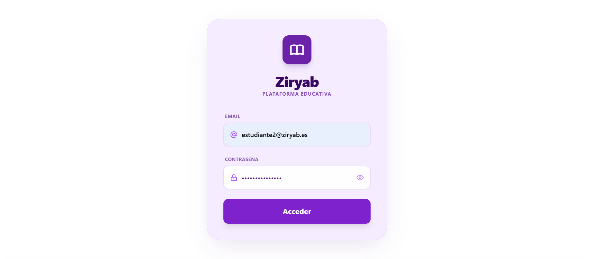

### 3.2 Introducir credenciales

1. Escribe tu **email** en el primer campo (icono de sobre).
2. Escribe tu **contraseña** en el segundo campo.
3. Opcional: pulsa el icono del ojo para **mostrar u ocultar** la contraseña.
4. Pulsa el botón principal para **acceder**.

### 3.3 Errores habituales en el login

- Si las credenciales son incorrectas, aparece un **mensaje de error en rojo** bajo el formulario.
- Si el campo email no es válido, el formulario no enviará la petición.
- Tras un login correcto, entrarás al **panel principal (Mi Espacio)**.

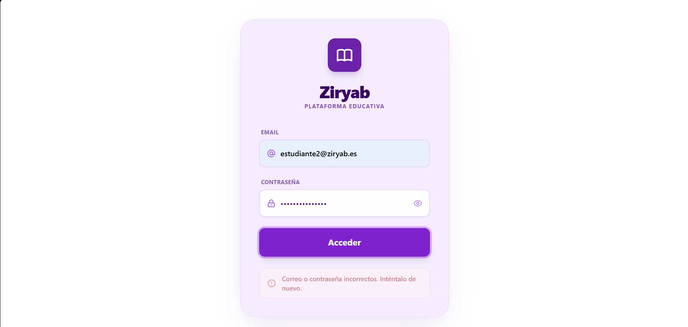

---

## 4. Interfaz general (cabecera)

En todas las pantallas privadas verás una **cabecera morada** fija con:

| Elemento | Ubicación | Función |
|----------|-----------|---------|
| Selector de idioma | Izquierda | Cambia entre ES / EN / DE |
| Logotipo **Ziryab** | Centro | Al pulsar, vuelves al **Dashboard** |
| Campana de notificaciones | Derecha | Abre el panel de notificaciones |
| Bloque de perfil (nombre + rol) | Derecha | Abre el menú de perfil |

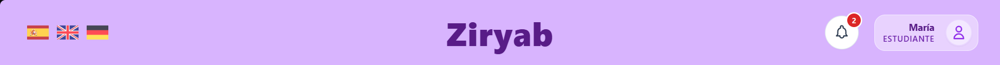

### 4.1 Notificaciones

1. Pulsa la **campana**; se abre un panel lateral o desplegable.
2. Verás la lista de avisos (tareas nuevas, calificaciones, etc.).
3. Puedes **marcar todas como leídas** si la opción está disponible.
4. Al llegar una notificación en tiempo real, puede aparecer un **toast** (aviso flotante) en la parte inferior de la pantalla durante unos segundos.

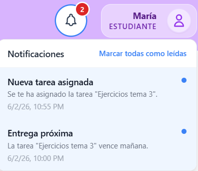

### 4.2 Menú de perfil y cierre de sesión

1. Pulsa tu **nombre y avatar** en la cabecera.
2. Se abre un modal con tu nombre, rol y el botón **Cerrar sesión**.
3. Confirma el cierre; volverás a la pantalla de login.

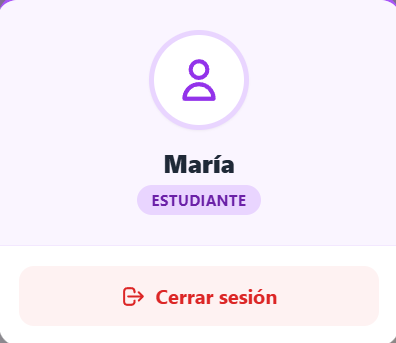

### 4.3 Botón «Volver»

En la mayoría de pantallas secundarias aparece el componente **Volver** (flecha atrás), que te lleva a la pantalla anterior en el historial de navegación.

---

## 5. Panel principal — «Mi Espacio» (Dashboard)

Tras iniciar sesión accedes a **Mi Espacio**, con el mensaje *«¿Qué te gustaría hacer hoy?»* y **dos tarjetas grandes**:

| Tarjeta | Descripción | Destino |
|---------|-------------|---------|
| **Clases** | Accede a tus asignaturas matriculadas | `/clases` |
| **Gestión** | Expediente, horario, calendario, avisos y notas | `/gestion` |

1. Haz clic en la tarjeta deseada (también al pasar el ratón verás la etiqueta **Acceder**).

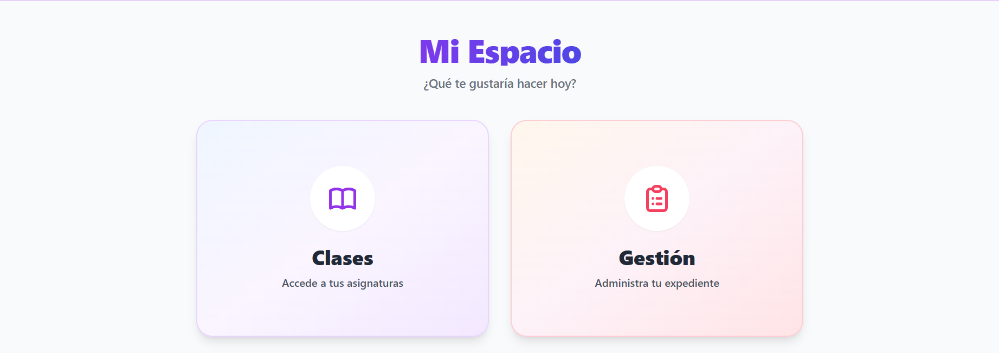

---

## 6. Mis asignaturas (Clases)

### 6.1 Listado de asignaturas

Ruta: **Dashboard → Clases** (`/clases`).

- Verás una **rejilla de tarjetas**, una por cada asignatura en la que estás matriculado.
- Cada tarjeta muestra, entre otros datos: **nombre de la asignatura**, **ciclo/curso**, **grupo** y **profesor** (cuando esté disponible).
- Mientras carga, aparece el mensaje *«Cargando tus clases...»*.
- Si no tienes matrículas, verás *«No estás matriculado en ninguna asignatura»*.

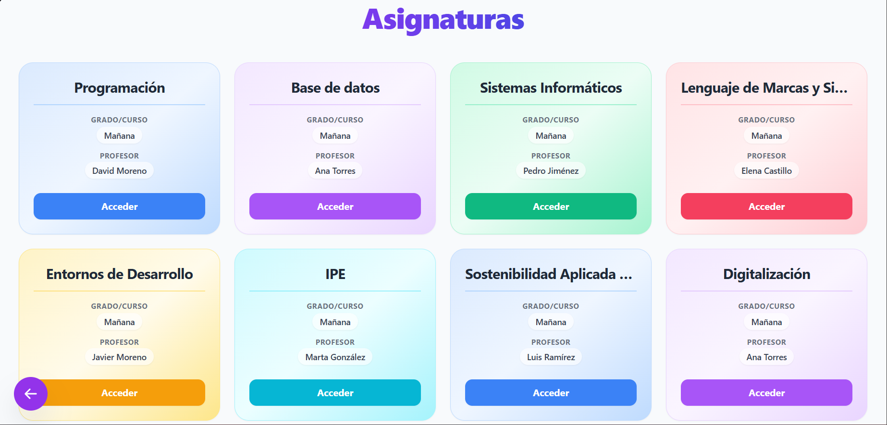

### 6.2 Entrar al temario de una asignatura

1. En la tarjeta de la asignatura, pulsa la acción principal (abrir / acceder al temario).
2. Irás a **Temario** (`/temario/:claseId`) con el material y las tareas de esa asignatura.

---

## 7. Temario y listado de tareas

### 7.1 Estructura del temario

El temario organiza el contenido en **bloques desplegables** por tipo:

- Material teórico y documentos  
- Exámenes y pruebas  
- Proyectos evaluables  
- Ejercicios prácticos  
- Deberes generales  

1. Pulsa la cabecera de un bloque para **expandirlo o contraerlo**.
2. Dentro verás las **tareas** con título, fecha límite y **estado**.

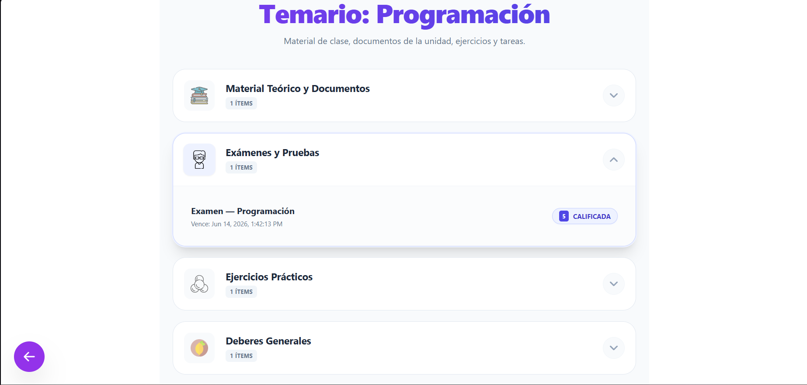

### 7.2 Estados de una tarea (en el listado)

| Estado | Significado |
|--------|-------------|
| **PENDIENTE** | Aún no has entregado (puede estar dentro o fuera de plazo) |
| **ENTREGADA** | Has enviado tu trabajo; pendiente de corrección |
| **CALIFICADA** | El profesor ha puesto nota (se muestra la puntuación) |
| **VENCIDA** | Plazo pasado sin entrega válida |

### 7.3 Abrir el detalle de una tarea

1. Pulsa sobre la fila de la tarea.
2. Se abre la pantalla de **detalle de tarea** (`/tarea/:id`).

---

## 8. Detalle de tarea: consulta, entrega y nota

### 8.1 Información de la tarea

En la parte superior verás:

- **Título** y **estado** (badge de color)
- **Fecha límite** de entrega
- **Tipo** de tarea (deberes, práctica, examen, etc.)
- **Descripción** del profesor
- **Material de consulta**: enlace para ver o descargar el archivo adjunto del profesor (si existe)

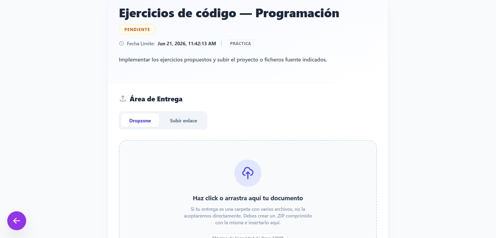

### 8.2 Si la tarea ya está calificada

Aparece la sección **Evaluación del profesor** con:

- **Nota final** (0–10)
- **Comentarios** del profesor (si los hubo)

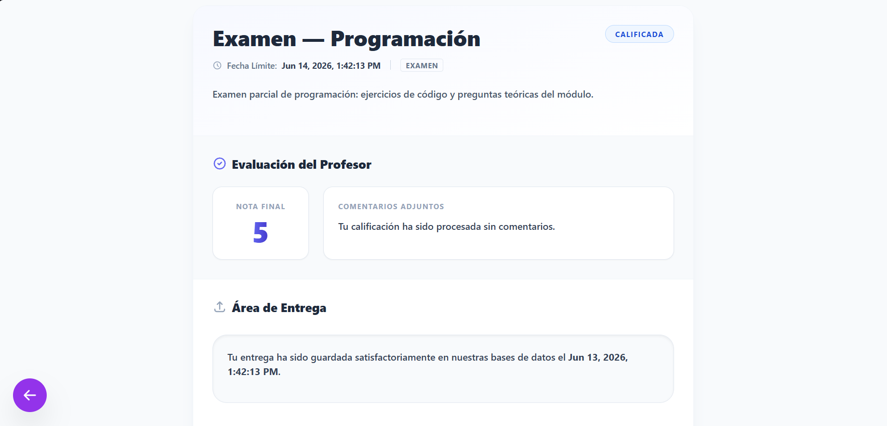

### 8.3 Entregar una tarea (pendiente)

En el **Área de entrega** puedes elegir dos modos:

#### Modo A — Subir archivo (Dropzone)

1. Selecciona la pestaña de subida de archivo.
2. **Arrastra** un archivo a la zona punteada **o** haz clic para elegirlo en el explorador.
3. Formatos habituales: documentos, imágenes, ZIP (si son varios archivos, **comprime en .ZIP**).
4. Tamaño máximo indicado en pantalla: **50 MB**.
5. Tras seleccionar el archivo, revisa el nombre y pulsa **Confirmar envío al servidor**.

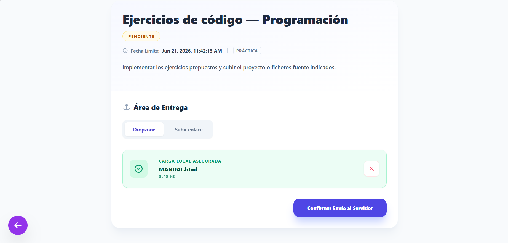

#### Modo B — Enlace URL

1. Cambia a la pestaña **Subir enlace**.
2. Introduce una URL válida (`http://` o `https://`), por ejemplo un Google Docs.
3. Pulsa **Confirmar envío al servidor**.

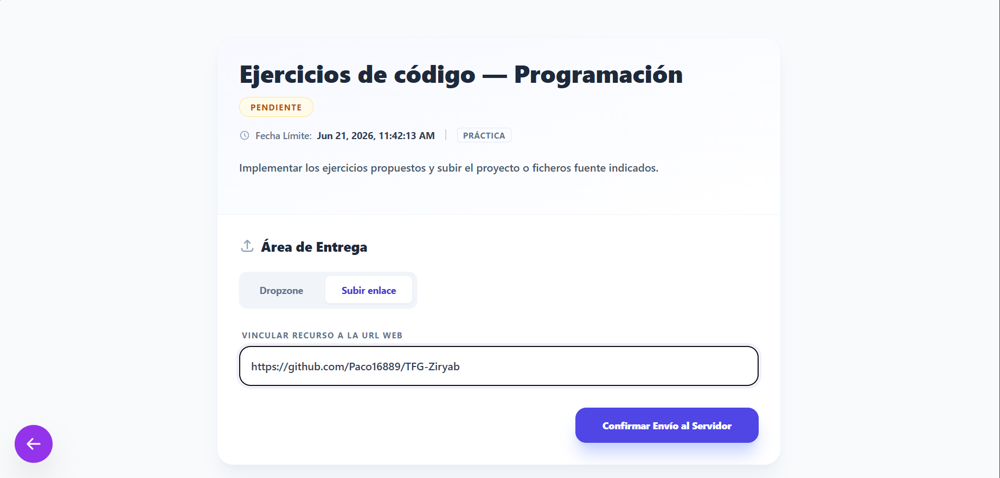

### 8.4 Avisos importantes al entregar

- Si el plazo ha pasado pero el profesor **permite entrega tardía**, tu entrega puede quedar como **Retraso (LATE)**.
- Si el plazo ha pasado y **no** se permiten entregas tardías, verás un aviso y **no podrás enviar**.
- Tras un envío correcto aparece mensaje verde de confirmación.

### 8.5 Modificar o borrar una entrega

- Si ya entregaste y **aún no está calificada**, puedes usar **Borrar entrega** y volver a subir.
- Si ya está **calificada**, no podrás eliminar la entrega desde esta pantalla.

### 8.6 Errores frecuentes en la entrega

| Mensaje / situación | Qué hacer |
|---------------------|-----------|
| Carpeta no permitida | Comprime la carpeta en un archivo **.ZIP** |
| Archivo demasiado grande | Reduce el tamaño por debajo de 50 MB |
| URL inválida | Comprueba que empiece por http:// o https:// |
| Error de servidor | Reintenta; si persiste, contacta con el profesor |

---

## 9. Gestión académica (menú central)

Ruta: **Dashboard → Gestión** (`/gestion`).

Pantalla **Gestión académica** con acceso a cinco áreas:

| Tarjeta | Función |
|---------|---------|
| **Ficha Usuario** | Historial de faltas y justificantes |
| **Horario** | Horario semanal de clases |
| **Calendario** | Calendario del centro (vista embebida) |
| **Tablón** | Anuncios / incidencias publicadas |
| **Evaluaciones** | Tus notas por trimestre |

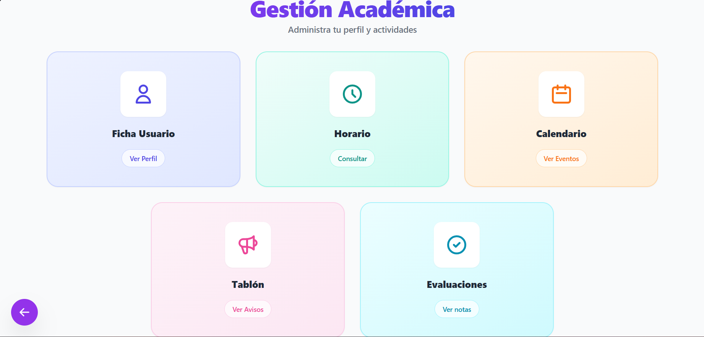

---

## 10. Ficha de usuario y asistencia

Ruta: **Gestión → Ficha Usuario** (`/ficha-usuario`).

### 10.1 Consultar faltas

- Listado de **faltas y retrasos** registrados por sesión.
- Cada fila muestra: **asignatura**, **fecha**, **hora**, **estado de asistencia** y **estado del justificante**.
- Si no tienes faltas, verás un mensaje positivo indicando que no hay registros.

Estados de asistencia:

| Etiqueta | Significado |
|----------|-------------|
| FALTA | Ausencia |
| RETRASO | Llegada tarde |
| JUSTIFICADA | Falta excusada oficialmente |

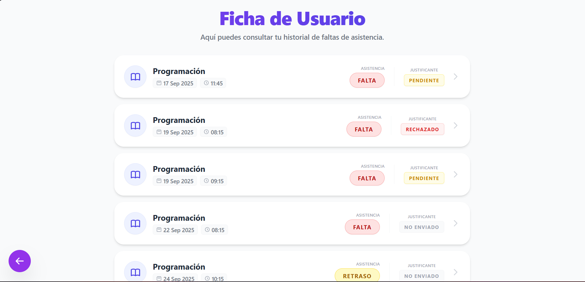

### 10.2 Justificar una falta

1. Pulsa sobre una falta que **no** esté ya justificada (filas interactivas).
2. Se abre el modal **Justificar falta**.
3. Selecciona un documento: **PNG, JPG o PDF**, máximo **1 MB**.
4. Pulsa **Subir justificante**.
5. El estado pasará a **PENDIENTE** hasta que el profesor lo revise.

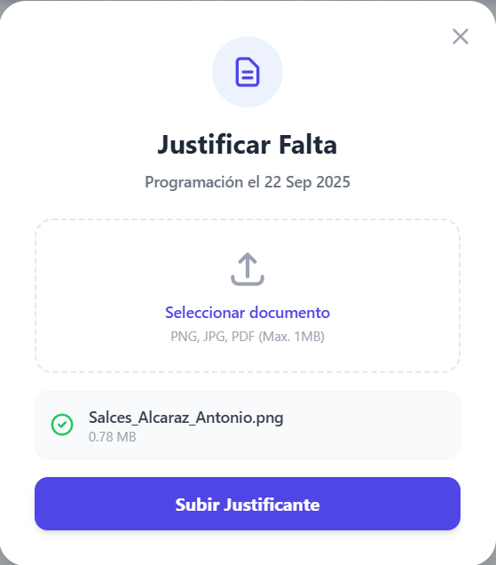

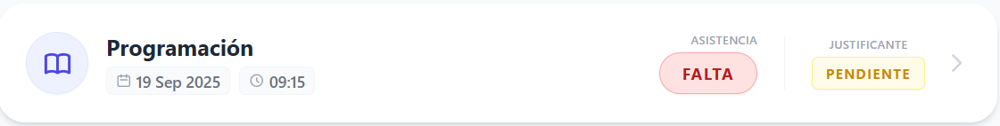

Estados del justificante: **NO ENVIADO**, **PENDIENTE**, **ACEPTADO**, **RECHAZADO**.

---

## 11. Horario semanal

Ruta: **Gestión → Horario** (`/horario-alumno`).

- Vista en **columnas por día de la semana** (lunes a viernes o según configuración del centro).
- En cada día aparecen las franjas con **hora inicio–fin** y **nombre de la asignatura**.
- Si un día no tienes clase, verás un mensaje de día sin clases.

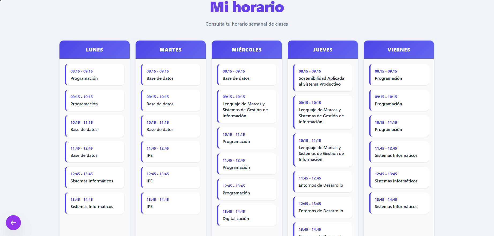

---

## 12. Calendario

Ruta: **Gestión → Calendario** (`/calendario`).

- Muestra un **calendario embebido** (iframe) con eventos del centro.
- Desplázate y navega dentro del calendario como en la herramienta externa configurada.

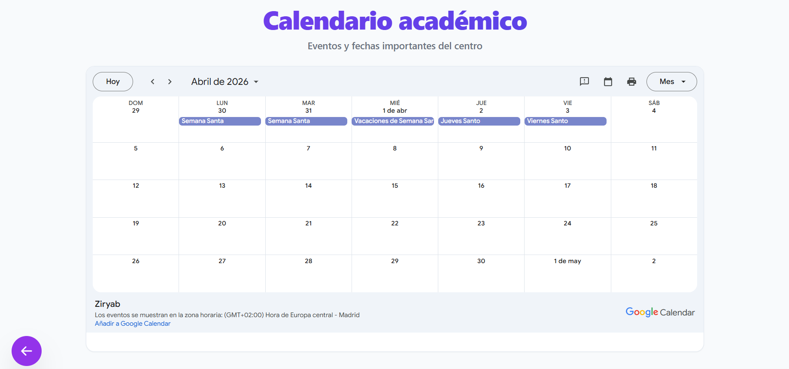

---

## 13. Tablón de anuncios

Ruta: **Gestión → Tablón** (`/issues`).

- Listado de **anuncios** publicados para la comunidad educativa.
- Consulta título, contenido y fecha de cada aviso (según diseño de la lista).

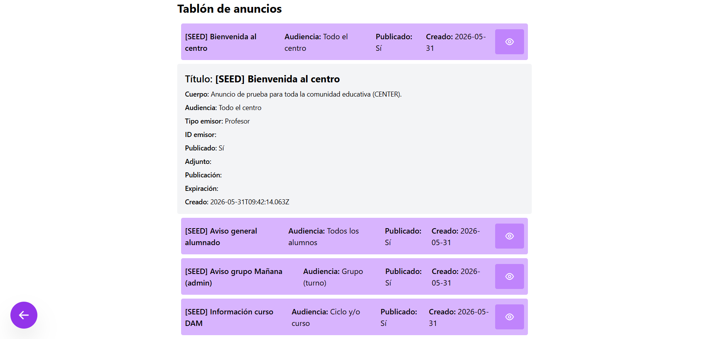

---

## 14. Mis evaluaciones (notas)

Ruta: **Gestión → Evaluaciones** (`/mis-evaluaciones`).

### 14.1 Tabla de calificaciones

- Tabla con **filas = asignaturas** y **columnas = periodos** de evaluación:
  - Evaluación inicial  
  - 1º, 2º y 3º trimestre  
  - Nota final  
- Las notas **inferiores a 5** suelen mostrarse en rojo; las aprobadas en verde.
- La última fila muestra la **nota media** por periodo.

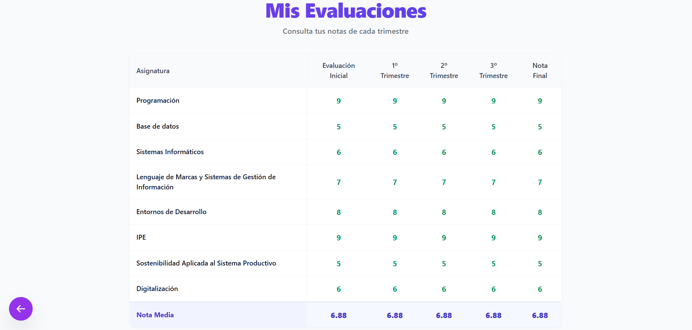

### 14.2 Sin calificaciones

Si el tutor o profesores aún no han introducido notas, verás: *«Aún no tienes calificaciones registradas»*.

---

## 15. Flujo de trabajo recomendado (resumen)

```text
Login → Mi Espacio → Clases → Temario → Tarea → Entregar
                  ↘ Gestión → Ficha / Horario / Calendario / Tablón / Evaluaciones
```

---

## 16. Preguntas frecuentes (FAQ)

**¿Puedo usar la app en el móvil?**  
Sí; la interfaz es responsive, aunque algunas tablas se desplazan horizontalmente.

**No veo ninguna asignatura**  
Tu matrícula puede no estar activa; contacta con secretaría o administración.

**He entregado pero sigue en PENDIENTE**  
Comprueba que recibiste el mensaje de éxito; refresca la página. Si persiste, avisa al profesor.

**Mi justificante fue rechazado**  
Sube un nuevo documento válido o consulta con el profesor el motivo.

**¿Cómo cambio el idioma?**  
Selector en la esquina superior izquierda de la cabecera.

---

## 17. Glosario

| Término | Definición |
|---------|------------|
| Temario | Conjunto de bloques y tareas de una asignatura |
| Entrega | Archivo o enlace que envías para una tarea |
| Trimestre | Periodo de evaluación académica |
| Justificante | Documento que acredita una ausencia |
| Tablón | Murales de avisos del centro |

---

*Fin del manual de alumno. Para incidencias técnicas, contacta con el administrador del centro.*
