# Manual de usuario — Profesor (Ziryab)

**Versión:** 1.0 · **Aplicación:** Ziryab — Plataforma Educativa  
**Rol:** Profesor (TEACHER)  
**Última actualización:** junio 2026 · **Capturas:** incluidas (26 y 27 pendientes)

---

## 1. Introducción

**Ziryab** permite al profesorado gestionar sus asignaturas: crear tareas, revisar entregas, calificar, pasar lista, validar justificantes de ausencia y, si actúas como **tutor/a de grupo**, registrar las evaluaciones trimestrales de tus alumnos.

Este manual cubre **todas las funcionalidades del rol TEACHER**.

---

## 2. Requisitos previos

| Requisito | Detalle |
|-----------|---------|
| Navegador | Chrome, Firefox, Edge o Safari actualizado |
| Credenciales | Cuenta de profesor con asignaturas asignadas en el sistema |
| Rol tutor (opcional) | Necesario para la pantalla **Evaluaciones** de grupo tutorizado |
| Idiomas | ES / EN / DE desde la cabecera |

---

## 3. Inicio de sesión

El acceso es idéntico al del alumno:

1. Abre la URL de Ziryab.
2. Introduce **email** y **contraseña**.
3. Pulsa el botón de acceso.

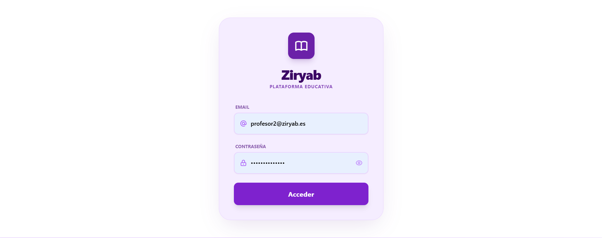

Tras un login correcto con rol **TEACHER**, entrarás al **Dashboard (Mi Espacio)** con las mismas dos tarjetas principales, pero la tarjeta **Clases** te llevará a **Mis clases** del profesor.

---

## 4. Interfaz general (cabecera)

La cabecera morada incluye:

| Elemento | Función |
|----------|---------|
| Selector de idioma | Cambia el idioma de la interfaz |
| **Ziryab** (centro) | Vuelve al Dashboard |
| Notificaciones | Avisos de entregas, justificantes, etc. |
| Perfil (nombre + «PROFESOR») | Menú con **Cerrar sesión** |

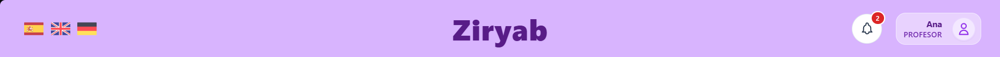

### 4.1 Notificaciones y cierre de sesión

- **Campana:** abre el listado de notificaciones; puedes marcarlas como leídas.
- **Perfil → Cerrar sesión:** finaliza la sesión de forma segura.

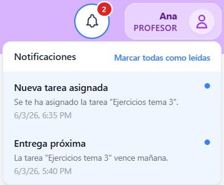

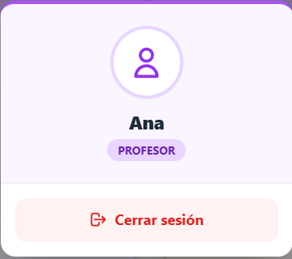

---

## 5. Panel principal — «Mi Espacio»

Pantalla inicial con dos accesos:

| Tarjeta | Destino (profesor) |
|---------|-------------------|
| **Clases** | `/clases-profesor` — Asignaturas que impartes |
| **Gestión** | `/gestion` — Ficha, horario, calendario, tablón, evaluaciones |

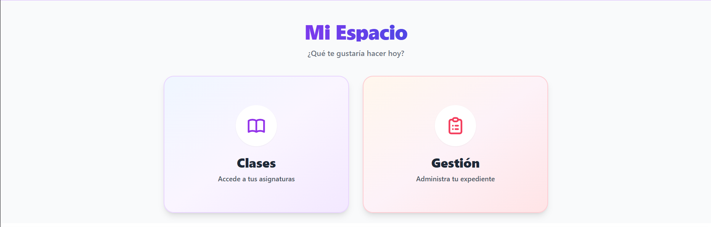

---

## 6. Mis clases (asignaturas asignadas)

Ruta: **Mi Espacio → Clases** (`/clases-profesor`).

### 6.1 Listado

Cada tarjeta representa una **asignación** (asignatura + grupo + ciclo) y muestra:

- Nombre de la **asignatura**
- **Ciclo** y **grupo**
- Dos acciones:
  1. **Gestionar temario** — Material, tareas y asistencia de esa asignatura
  2. **Menú de clase** — Acceso rápido a tareas y justificaciones

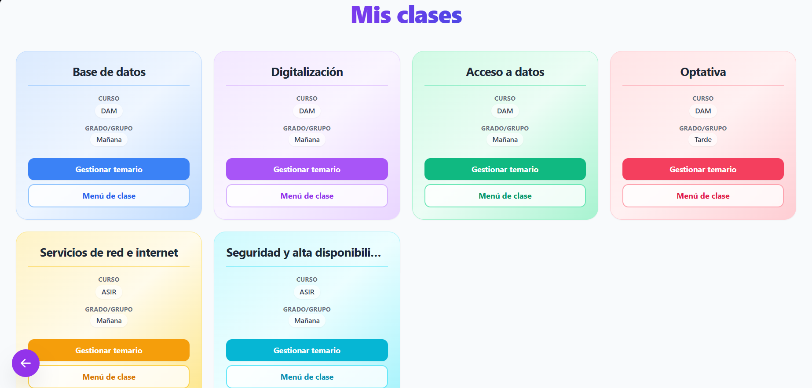

### 6.2 Sin asignaturas

Si no tienes asignaturas asignadas, verás un mensaje informativo. Contacta con administración para revisar tu carga docente en el sistema.

---

## 7. Programación / Temario del profesor

Ruta: **Gestionar temario** → `/temario-profesor/:claseId`

### 7.1 Vista general

- Título **Programación**.
- Botón **Pasar lista** (esquina superior derecha): abre el modal de asistencia.
- Bloques por tipo de contenido (teoría, exámenes, proyectos, prácticas, deberes), igual que ve el alumno pero con **controles de profesor**.

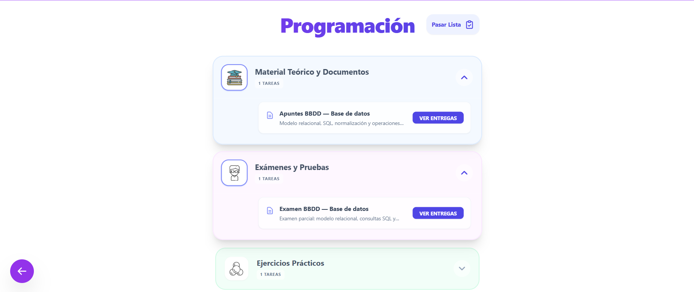

### 7.2 Gestionar tareas dentro del temario

En cada bloque expandido, cada tarea muestra:

- Título y descripción
- **Ver archivo base** — Abre el adjunto que subiste al crear la tarea
- **Ver entregas** — Ir al listado de entregas de los alumnos

### 7.3 Pasar lista (asistencia)

1. Pulsa **Pasar lista**.
2. Se abre un **modal** con la lista de alumnos matriculados.
3. Para cada alumno, selecciona el estado:
   - **Presente**
   - **Ausente**
   - **Retraso**
   - **Justificado**
4. Pulsa **Guardar asistencia**.
5. Mensaje de confirmación si se guardó correctamente.

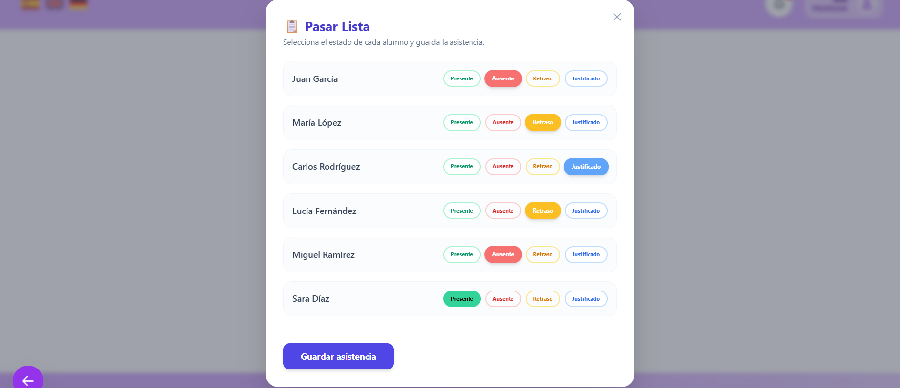

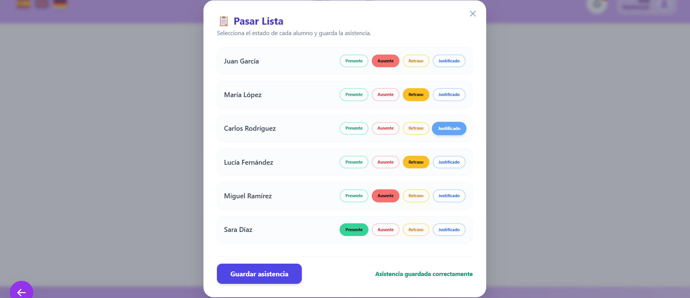

**Nota:** Debes pasar lista en la sesión correspondiente al día; si no hay alumnos matriculados, el sistema lo indicará.

---

## 8. Menú de clase

Ruta: **Menú de clase** desde una tarjeta → `/menu-clase/:idTeacherAssignment`

Pantalla intermedia con **dos opciones**:

| Opción | Descripción | Ruta |
|--------|-------------|------|
| **Tareas** | Crear y listar tareas de la asignación | `/tareas/:idTeacherAssignment` |
| **Justificaciones** | Revisar justificantes de faltas | `/ficha-profesor` (vista de justificaciones) |

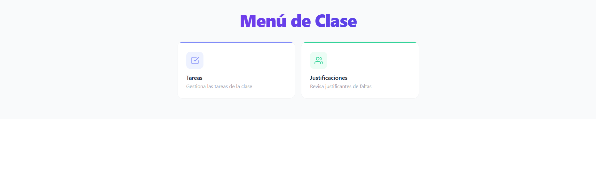

---

## 9. Gestión de tareas

Ruta: **Menú de clase → Tareas** (`/tareas/:idTeacherAssignment`).

### 9.1 Listado agrupado

- Las tareas se agrupan por **tipo** (deberes, práctica, teoría, proyecto, examen) con código de color.
- En la cabecera: número total de tareas y botón **+ Crear tarea**.
- Cada ítem permite ver detalle y acciones según el componente de lista.

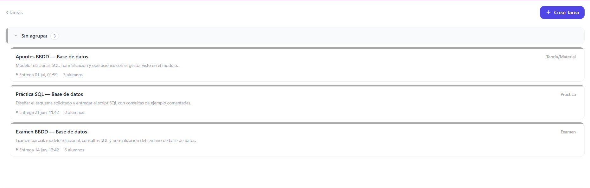

### 9.2 Crear una nueva tarea

1. Pulsa **Crear tarea** (botón indigo con icono +).
2. Se abre el formulario modal **Crear nueva tarea**.

Campos del formulario:

| Campo | Obligatorio | Descripción |
|-------|-------------|-------------|
| Título | Sí | Nombre visible para el alumno |
| Descripción | No | Instrucciones de la actividad |
| Tipo | Sí | Deberes, práctica, teoría/material, proyecto, examen |
| Fecha de inicio | Sí | Cuándo se publica |
| Fecha límite | Sí | Deadline de entrega |
| Fichero adjunto | No | Material de apoyo (PDF, DOCX, ZIP, PNG, JPG; máx. 10 MB) |
| Permite entrega tardía | Según diseño | Si está activo, los alumnos pueden entregar fuera de plazo (marcado LATE) |

3. Opcional: arrastra un archivo o selecciónalo.
4. Pulsa **Crear tarea**.
5. Tras el éxito, la tarea aparecerá en el listado y en el **temario** del alumno.

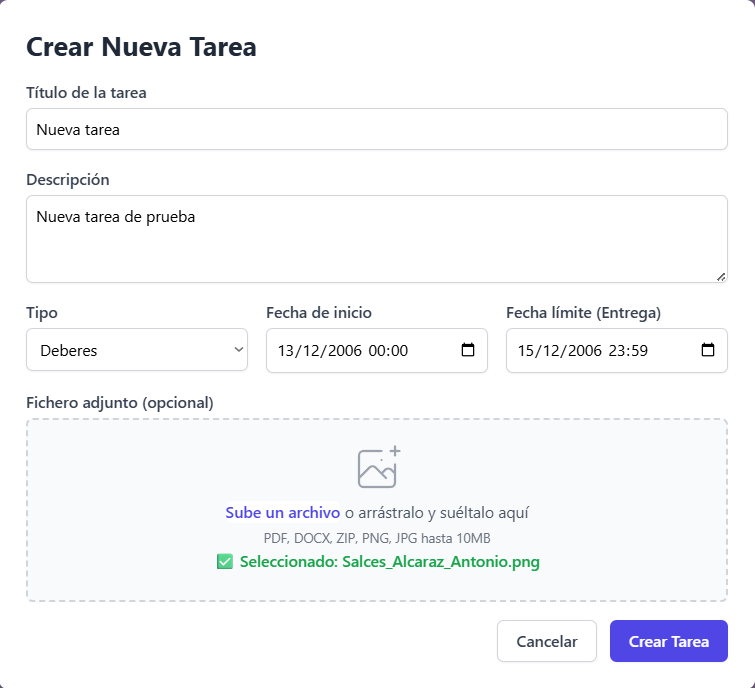

### 9.3 Errores al crear tarea

- Archivo mayor de 10 MB → error de tamaño.
- Error de servidor → revisa conexión y reintenta.

---

## 10. Entregas de los alumnos

Ruta: **Temario → Ver entregas** o desde detalle de tarea → `/tarea/:taskId/entregas`

### 10.1 Pantalla de entregas

Información mostrada:

- Título de la tarea y **fecha límite**
- Tabla o listado con columnas: **Alumno**, **Estado**, **Fecha entrega**, **Nota**, **Acciones**

Estados habituales:

| Estado | Significado |
|--------|-------------|
| Pendiente | Sin entrega |
| Entregada | Entrega a tiempo |
| Retraso / Entregada tarde | Fuera de plazo permitido |
| Calificada | Ya tiene nota |
| No entregado | Plazo cerrado sin entrega |

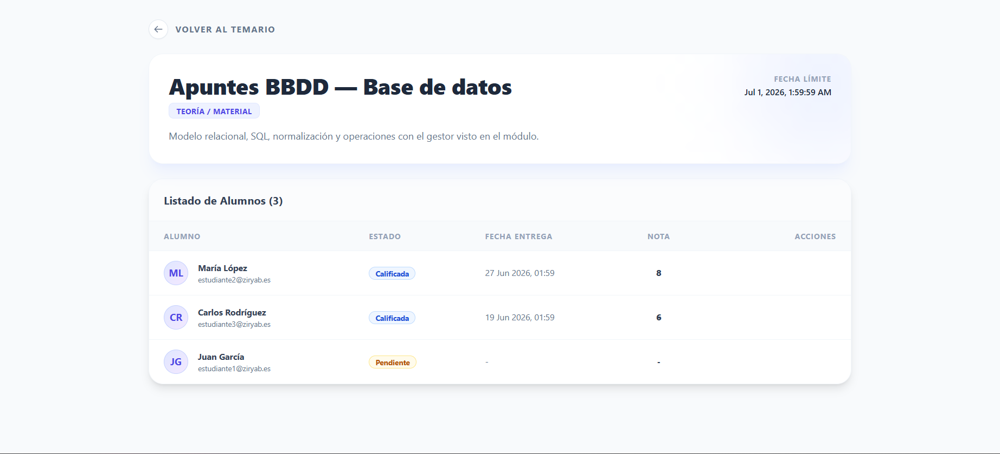

### 10.2 Acciones por entrega

- **Abrir archivo/enlace** de la resolución del alumno (si entregó).
- **Calificar** o **Editar nota** — Abre la pantalla de corrección.

---

## 11. Calificar una entrega

Ruta: `/calificar-tarea/:id` (ID de la entrega del alumno)

### 11.1 Datos de la entrega

La pantalla muestra:

- Nombre del **alumno**
- **Tarea** evaluada
- **Momento de entrega** (fecha/hora)
- **Archivo entregado** — enlace Ver / Descargar

### 11.2 Formulario de corrección

| Campo | Reglas |
|-------|--------|
| Calificación (0–10) | Obligatoria; valor entre 0 y 10 |
| Comentarios y feedback | Opcional; visible para el alumno |

1. Introduce la **nota**.
2. Opcional: escribe observaciones en **Feedback**.
3. Pulsa **Guardar calificación**.

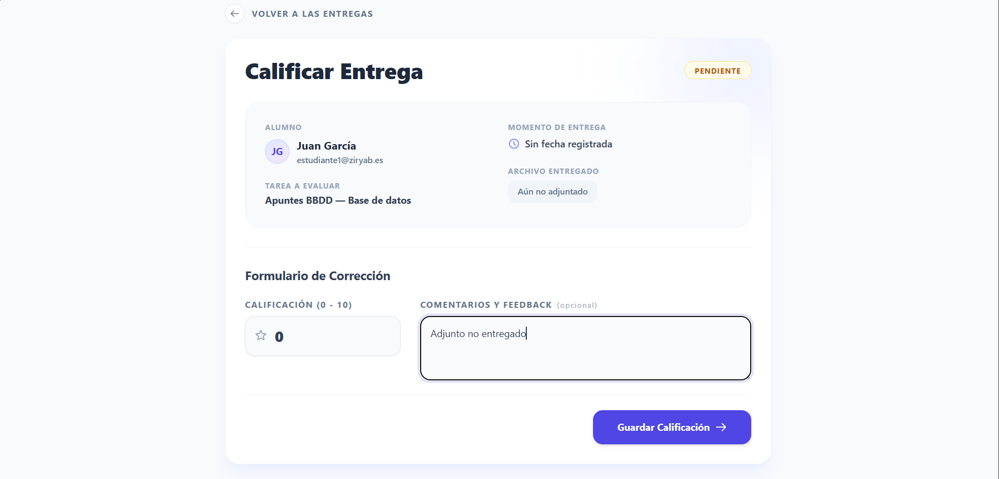

El alumno verá la nota en su detalle de tarea y en el temario (estado CALIFICADA).

---

## 12. Justificaciones de faltas

Ruta: **Menú de clase → Justificaciones** o ficha de profesor (`/ficha-profesor`).

### 12.1 Justificaciones pendientes

- Listado de alumnos que han subido un **justificante** en estado pendiente.
- Por cada fila: nombre del alumno, fecha/hora de la sesión, asignatura.
- Acciones:
  - **Ver archivo** — Abre el documento subido (PDF/imagen)
  - **Aceptar** — La falta pasa a justificada
  - **Rechazar** — El justificante se rechaza; el alumno puede volver a enviar otro

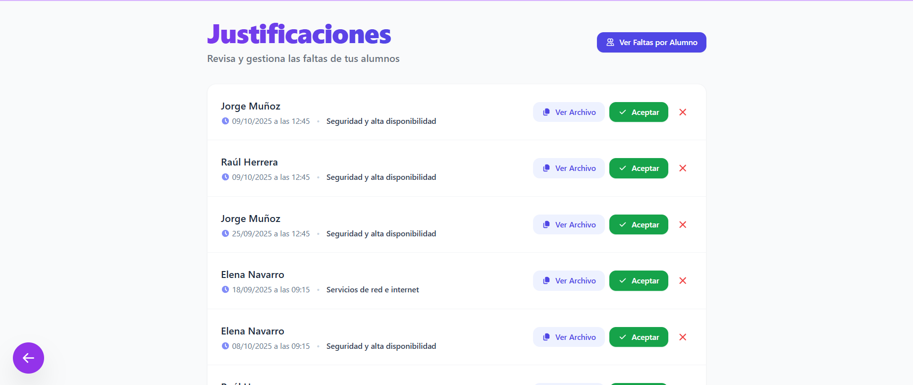

### 12.2 Sin pendientes

Mensaje: *«Todo al día»* / *«No hay nuevas justificaciones pendientes de revisar»*.

### 12.3 Ver faltas por alumno

- Botón **Ver faltas por alumno** (parte superior).
- Abre un modal para consultar el historial de ausencias de un estudiante concreto.

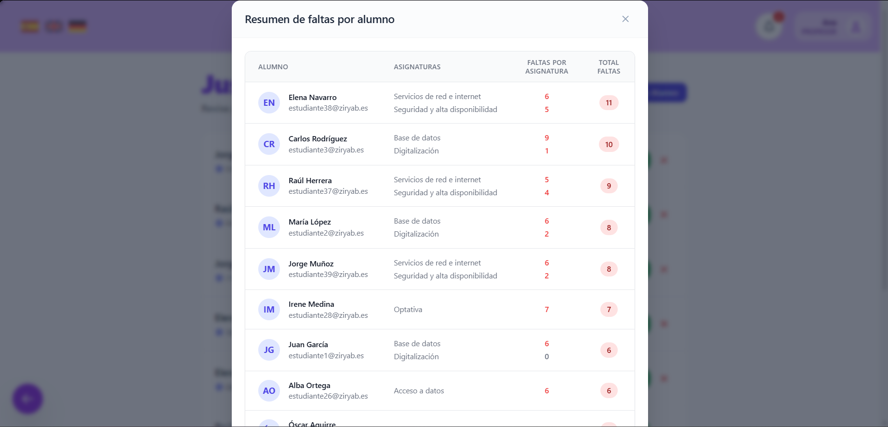

---

## 13. Gestión académica (área común)

Ruta: **Mi Espacio → Gestión** (`/gestion`).

Las mismas tarjetas que el alumno, con rutas adaptadas al rol:

| Tarjeta | Destino profesor |
|---------|------------------|
| Ficha Usuario | `/ficha-usuario` (datos personales; según configuración) |
| Horario | `/horario-profesor` |
| Calendario | `/calendario` |
| Tablón | `/issues` |
| Evaluaciones | `/evaluaciones` (solo si eres **tutor** de un grupo) |

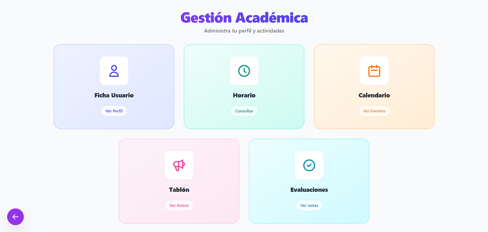

---

## 14. Horario del profesor

Ruta: **Gestión → Horario** (`/horario-profesor`).

- Cuadrícula semanal con tus **franjas de clase** asignadas.
- Cada celda indica hora y asignatura/grupo.

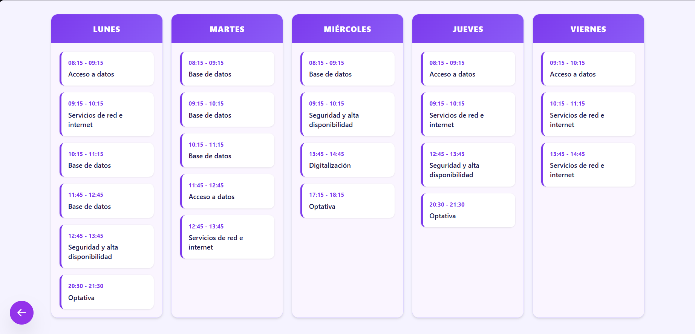

---

## 15. Calendario y tablón

- **Calendario:** iframe con el calendario institucional (`/calendario`).
- **Tablón:** anuncios publicados para toda la comunidad (`/issues`).

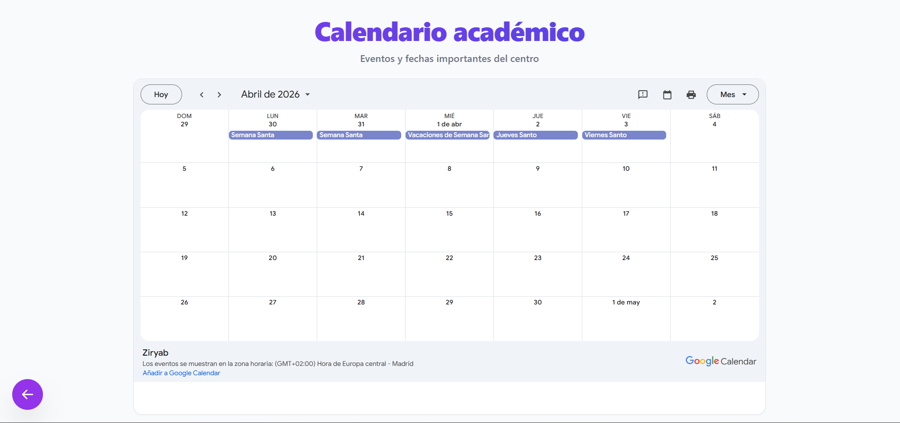

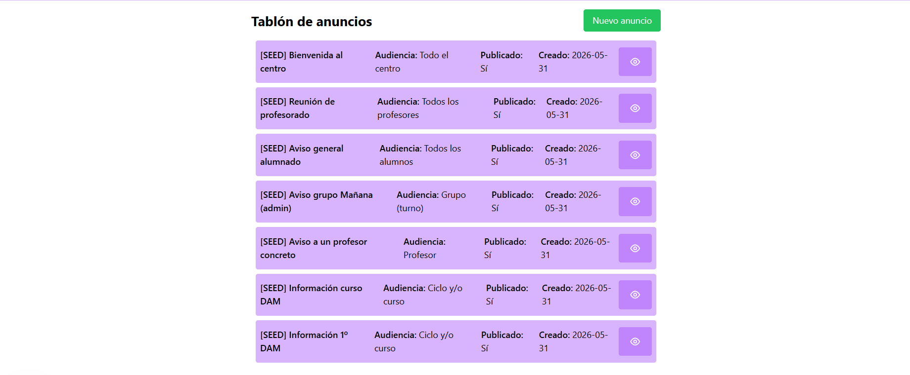

### 15.1 Crear un anuncio en el tablón

1. Accede al **Tablón** desde Gestión.
2. Pulsa la opción para **crear un nuevo anuncio** (si tu rol lo permite).
3. Rellena título y contenido del aviso.
4. Publica el anuncio; quedará visible para la comunidad educativa.

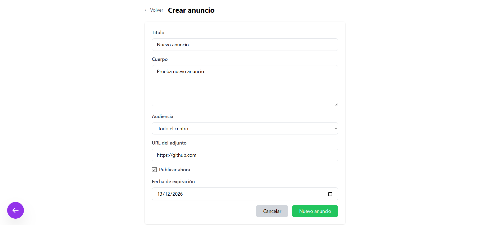

---

## 16. Evaluaciones (rol de tutor)

Ruta: **Gestión → Evaluaciones** (`/evaluaciones`).

**Solo disponible si el sistema te tiene registrado como tutor de un grupo.**

### 16.1 Pantalla principal

- Selector de **grupo tutorizado** (si hubiera más de uno).
- Selector de **periodo de evaluación** (inicial, trimestres, final).
- Tabla: filas = alumnos del grupo; columnas = asignaturas; celdas = notas (1–10).
- Fila o indicador de **media** por alumno/asignatura.

> **📷 CAPTURA 26 — Pantalla Evaluaciones con tabla de notas del grupo**

### 16.2 Introducir y guardar notas

1. Selecciona el **periodo** correcto.
2. Rellena todas las celdas obligatorias con notas entre **1 y 10**.
3. Pulsa **Guardar evaluaciones**.
4. Espera el mensaje de éxito.

**Importante:** El sistema puede exigir que **todas** las asignaturas de **todos** los alumnos tengan nota antes de guardar.

> **📷 CAPTURA 27 — Mensaje de notas guardadas correctamente**

### 16.3 Sin grupo tutorizado

Si no eres tutor, verás: *«No se ha encontrado ningún grupo del que seas tutor»*.

---

## 17. Flujos de trabajo recomendados

### 17.1 Publicar una tarea y calificarla

```text
Mis clases → Gestionar temario → (o Menú de clase → Tareas) → Crear tarea
→ Alumnos entregan → Ver entregas → Calificar → Alumno ve la nota
```

### 17.2 Sesión de clase con asistencia

```text
Mis clases → Gestionar temario → Pasar lista → Guardar asistencia
```

### 17.3 Revisar una ausencia justificada

```text
Menú de clase → Justificaciones → Ver archivo → Aceptar o Rechazar
```

---

## 18. Preguntas frecuentes (FAQ)

**¿Por qué no veo Evaluaciones en Gestión?**  
Esa pantalla es solo para profesores **tutores**. La asignación la realiza administración.

**Un alumno dice que no puede entregar**  
Comprueba la **fecha límite** y si la tarea permite **entrega tardía**. Revisa en el detalle de la tarea.

**¿Puedo cambiar una nota ya guardada?**  
Sí; vuelve a **Ver entregas → Editar nota** en la entrega del alumno.

**El archivo adjunto de creación de tarea falla**  
Máximo 10 MB; usa formatos permitidos (PDF, DOCX, ZIP, imágenes).

**No aparecen alumnos al pasar lista**  
Verifica que haya **matriculaciones** activas en esa asignatura-grupo.

---

## 19. Glosario docente

| Término | Definición |
|---------|------------|
| Asignación | Relación profesor–asignatura–grupo en el sistema |
| Entrega (student-task) | Trabajo enviado por un alumno para una tarea |
| Tutor | Profesor responsable de las notas trimestrales del grupo |
| Justificante | Documento del alumno para excusar una falta |
| LATE | Entrega realizada después del plazo pero permitida |

---

## 20. Resumen de rutas (referencia rápida)

| Pantalla | Ruta |
|----------|------|
| Login | `/login` |
| Dashboard | `/dashboard` |
| Mis clases | `/clases-profesor` |
| Temario | `/temario-profesor/:claseId` |
| Menú de clase | `/menu-clase/:idTeacherAssignment` |
| Tareas | `/tareas/:idTeacherAssignment` |
| Entregas | `/tarea/:taskId/entregas` |
| Calificar | `/calificar-tarea/:id` |
| Justificaciones | `/ficha-profesor` |
| Gestión | `/gestion` |
| Horario | `/horario-profesor` |
| Evaluaciones (tutor) | `/evaluaciones` |

---

*Fin del manual de profesor. Para configuración de grupos, matrículas o asignación de tutorías, contacta con el rol de administración del centro.*
